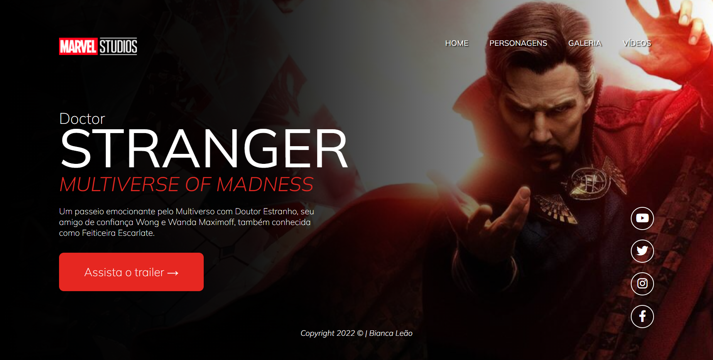
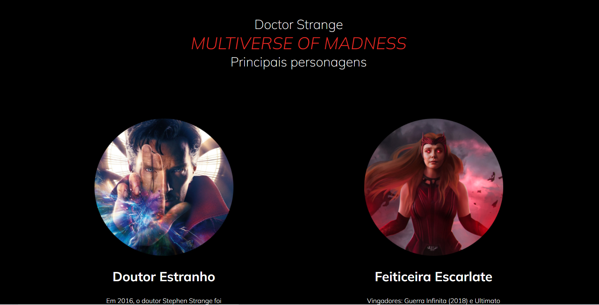
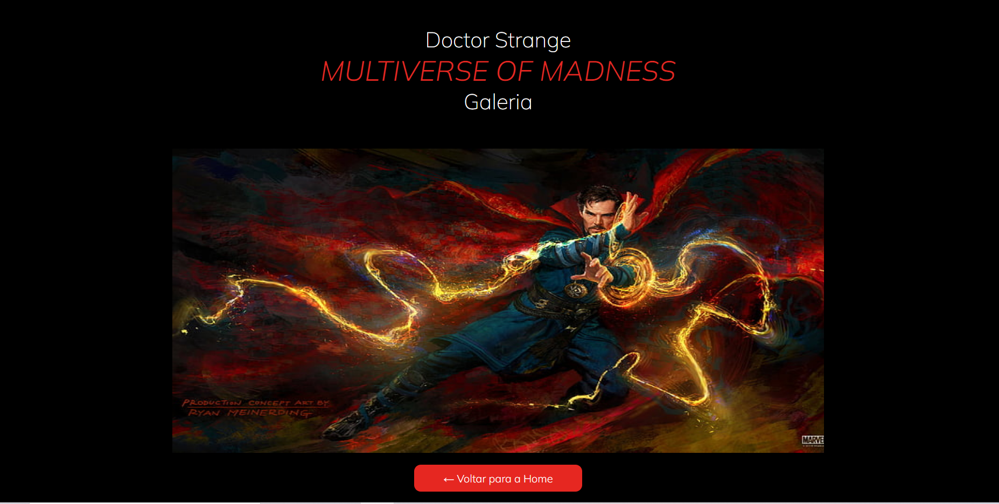
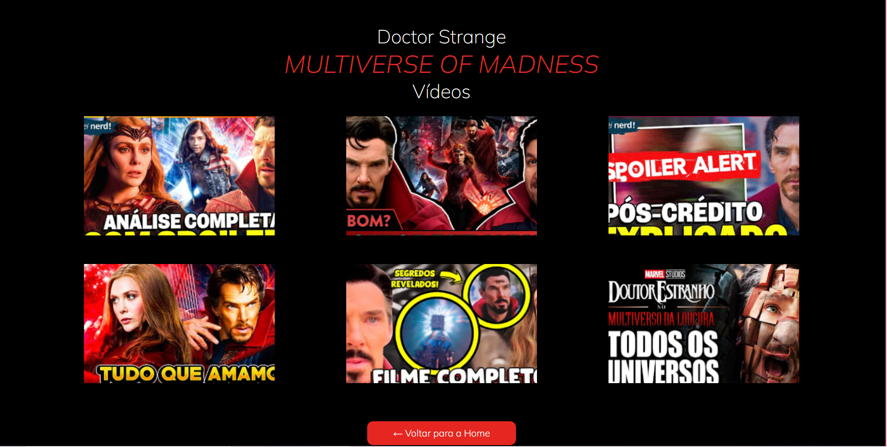

# Doutor Estranho: MULTIVERSE OF MADNESS

  Projeto para aplicar o que o professor Fernando Leonid ensinou, além de aprimorar minhas habilidades em HTML, CSS e JS.

  ##  Home

  

  ## Personagens

  
  
  ## Galeria

  

  ## Vídeos

  

 ##  Protótipo do site 

- [Clique aqui para ver o figma](https://www.figma.com/file/G17Secn7GAdWm8hF5brSw2/desafioStrange?node-id=0%3A1&t=xttJjaHzU3shjnsU-0)

 ##  Tecnologias utilizadas

- HTML
- CSS
- JAVASCRIPT
- Markdown
- Responsividade
- VLibras (tecnologia de acessibilidade)

  ## Direitos autorais
  
   * https://www.youtube.com/watch?v=24G8dGNUsXM 
   * https://www.youtube.com/watch?v=csNYVAS2ex8&t=165s

## Autora

- [Bianca Leão](https://github.com/leaobia)
